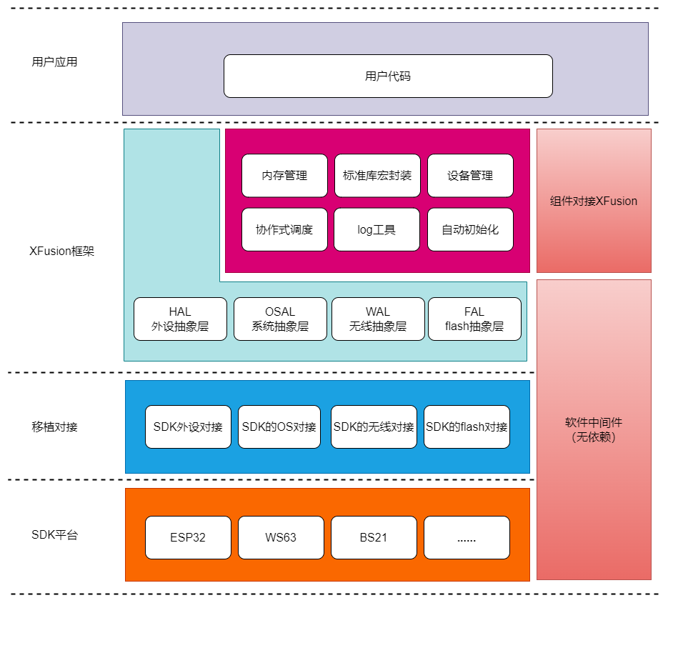

# 介绍

**XFusion**，来自 **X(Embedded Kits System)** —— 嵌入式套件系统，是一个融合多个嵌入式平台的软件开发工具包(SDK)，为开发者提供**统一且便于开发的嵌入式开发环境**。

开发者基于 XFusion 开发应用时，无需花过多时间及精力在移植（像 RTOS），基础驱动、基础功能的实现等与平台底层相关的工作，可以更专注于应用功能的设计与实现，并且，在其上开发的应用，可以在多平台上快速迁移、切换。(**一次开发，多端部署**)

Fusion，意为融合、联合，且有核聚变的意思，表达了 XFusion 的愿景：让分散的平台融合在一起，凝聚出更大的能量，更好地支持开发者实现他们的想法。

# 特性

- xf_build 跨平台构建工具；
- xf_log log 打印调试工具；
- xf_task 协作式调度器；
- xf_hal 基础硬件抽象层；
- xf_heap 内存管理工具；
- xf_osal 系统抽象层；
- xf_utils 基础功能；
- 所有子模块可作为软件中间件独立移植
- 全部由 C 编写完成，遵从 C99 语法；
- 丰富详实的例程；
- 丰富强大的组件库；
- 采用 Apache2.0 开源协议；
- 支持导出原生工程，可以使用 keil 等原生 IDE 开发调试；

# 硬件要求

- 16、32 或 64 位微控制器或处理器。
- 建议使用 >16 MHz 时钟速度。
- 闪存/ROM：

  \> 64 kB 用于非常重要的组件 (> 建议使用 180 kB)。

- RAM:

  - 静态 RAM 使用量：~2 kB，取决于使用的功能和对象类型。
  - 堆: > 2kB (> 建议使用 8 kB 以上)。

- C99 或更新的编译器。

以下结果为 xfusion 基础组件大小，排除了对接部分的大小，对接部分大小见`基础组件大小详情`​。

| 描述     | 优化等级 | flash(bytes) | ram(bytes) |
| -------- | -------- | ------------ | ---------- |
| 空间优先 | Os       | 4,209        | 385        |
|          | Og       | 4,742        | 385        |
| 调试     | Og       | 15,043       | 4,484      |

**空间优先**

- 关闭 log
- 关闭 xf_heap 静态数组(静态内存池设为 1 byte)

**调试**

- 开启 log
- xf_heap 静态数组大小设为 4KB

# 目前支持的平台

1. esp32 (基于 esp-idf v5.0)
2. ws63 (HI3863 芯片)
3. bs21 (HI2821 芯片)

后续计划支持：

4. linux
5. esp32c3
6. stm32

# 开源证书

> [!IMPORTANT] Apache License 2.0
> XFusion 及其子模块全部使用 [Apache License 2.0](https://www.apache.org/licenses/LICENSE-2.0) 协议

# 存储库布局

> [!IMPORTANT] 重要
> 所有仓库均能独立移植

- github:
  - [**XFusion**](https://github.com/x-eks-fusion/xfusion): xfusion 主仓库
  - [**xf_utils**](https://github.com/x-eks-fusion/xf_utils): 工具库，有标准库的宏封装，基础的log等级封装，lock锁，链表等功能
  - [**xf_log**](https://github.com/x-eks-fusion/xf_log)：log库，可以对接多个底层。还有过滤器，可以根据你想要的内容过滤log。
  - [**xf_init**](https://github.com/x-eks-fusion/xf_init)：初始化库，提供不同自动初始化实现
  - [**xf_hal**](https://github.com/x-eks-fusion/xf_hal)：外设管理库，提供硬件抽象层，管理硬件设备。
  - [**xf_heap**](https://github.com/x-eks-fusion/xf_heap)：内存管理库，提供基础的内存管理。也可以对接底层的内存管理
  - [**xf_task**](https://github.com/x-eks-fusion/xf_task)：协作式调度器库，提供协作式多任务功能
  - [**xf_osal**](https://github.com/x-eks-fusion/xf_osal)：操作系统抽象库，提供统一的操作系统API
- gitee:
  - [**XFusion**](https://gitee.com/x-eks-fusion/xfusion): xfusion 主仓库
  - [**xf_utils**](https://gitee.com/x-eks-fusion/xf_utils) 工具库，有标准库的宏封装，基础的log等级封装，lock锁，链表等功能
  - [**xf_log**](https://gitee.com/x-eks-fusion/xf_log)：log库，可以对接多个底层。还有过滤器，可以根据你想要的内容过滤log。
  - [**xf_init**](https://gitee.com/x-eks-fusion/xf_init)：初始化库，提供不同自动初始化实现
  - [**xf_hal**](https://gitee.com/x-eks-fusion/xf_hal)：外设管理库，提供硬件抽象层，管理硬件设备。
  - [**xf_heap**](https://gitee.com/x-eks-fusion/xf_heap)：内存管理库，提供基础的内存管理。也可以对接底层的内存管理
  - [**xf_task**](https://gitee.com/x-eks-fusion/xf_task)：协作式调度器库，提供协作式多任务功能
  - [**xf_osal**](https://github.com/x-eks-fusion/xf_osal)：操作系统抽象库，提供统一的操作系统API

