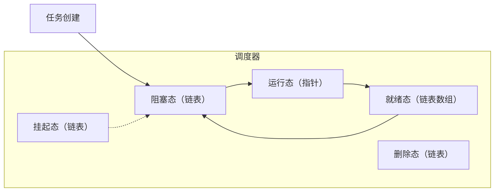
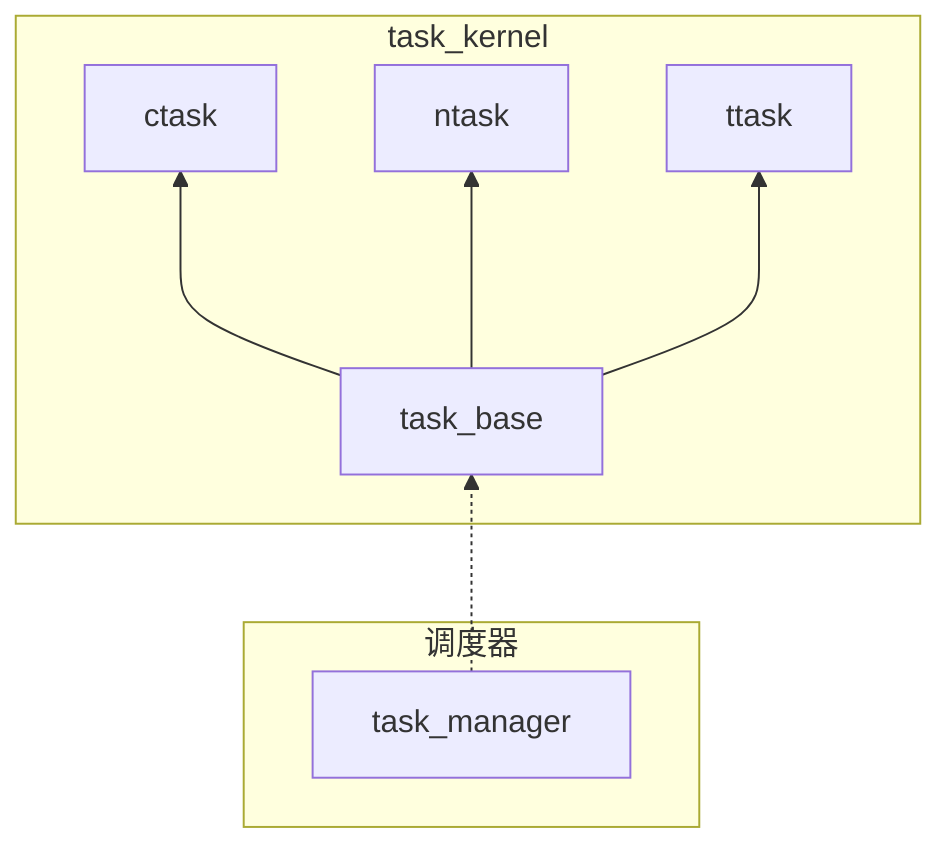

# xf task 协程调度器详解

> [!NOTE] 作者
> kirto

本文主要说明，xf task的功能、移植和使用。

# xf_task 介绍

## 背景

在嵌入式系统中，任务调度是系统运行的核心。场景的调度方式有抢占式和协作式。
抢占式调度是大多数实时操作系统（RTOS）采用的方式，能够中断正在运行的任务切换到优先级更高的任务，适用于对实时性要求高的场景。
但实现较为复杂，容易引发资源竞争，每个任务的开销大也是其无法适用于更加极限的嵌入式环境中。
相比之下，协作式调度在任务主动让出 CPU 控制权时进行切换。其实现简单、切换开销小，更容易避免资源竞争问题。
尽管市面上绝大多数 RTOS 以抢占式调度为主，但在许多低功耗和资源受限的场景中，协作式调度的优势往往更加重要。

## 介绍
xf_task 是 XFusion 的一个核心功能。其本身是一个轻量级协作式调度器。可以跑在多线程的环境下也可以跑在裸机的环境中。
相比于RTOS，其本身的占用仅仅需要4k左右，且创建一个ntask任务仅仅需要xx的大小。
xf_task 实现了三种任务：ctask（有栈协程）、 ntask（无栈协程）和 ttask （定时器任务）
ctask 提供了上下文保存，使用体验上无限接近于线程。
ntask 提供了非常轻量的任务方式，非常适合资源受限的嵌入式设备。
ttask 提供了软件定时器的拓展。

## 功能

xf task支持非常丰富的功能，这些功能后续会一一进行详细介绍：

1. 协作式调度，支持裸机移植，支持多线程中构造多个调度器 [裸机和多线程中移植](#裸机和多线程中移植)
2. 支持三种种任务，ttask （定时任务）、ntask（无栈协程）、ctask （有栈协程）[三种任务用法](#三种任务的用法)
3. 移植简单，ttask、ntask 仅需对接时间戳的获取。ctask 对接上下文的创建和切换函数（可通过宏屏蔽）[配置项]()
4. 支持协作式优先级  [优先级机制]()
5. 支持两种消息队列，queue和ctask_queue [消息队列机制]()
6. 支持任务触发机制 [时间触发和事件触发]()
7. 支持紧急任务 [紧急任务机制]()
8. 支持任务饥饿度机制 [任务饥饿与饥饿度]()
9. 支持 mbus 发布订阅机制 [解耦的发布订阅机制]()
10. 支持任务池机制 [任务池和任务回收机制]()
11. 仅依赖 xf_utils, 支持 c99 

## 开源地址

> github 开源地址：https://github.com/x-eks-fusion/xf_task <br>
> gitee 开源地址：https://gitee.com/x-eks-fusion/xf_task

# 原理介绍

## 调度器原理

### 调度流程图



### 调度流程解析

#### 源码位置
调度部分的代码主要是在 `src/kernel/xf_task_manager.c` 文件的 `void xf_task_manager_run(xf_task_manager_t manager)` 函数中。

#### 调度流程

1. 任务创建：
    - 不同的任务创建过程并不相同。但是它们共同继承 xf_task_base_t 基类
    - 无论什么任务，创建后会进入阻塞态
2. 阻塞态：
    - 通过handle的虚函数，不同的任务有不同的阻塞条件处理函数。
    - ctask和ntask由于无阻塞条件，所以自动进入就绪态。后续遇到delay等函数才会带着阻塞条件（时间或事件）再次进入阻塞态
    - ttask会经过一次delay时间后，从阻塞态过度到就绪态
    - 此外这里会对比所有时间条件的最小值，这将为后续的空闲任务提供最大的休息时间
3. 就绪态：
    - 就绪态会从高到低不同优先级（数值越小优先级越高）找到可执行的任务并让其进入运行态。
    - 就绪态找到了可以运行的任务后就不会继续遍历
    - 如果没有就绪任务，则会再次更新阻塞态中时间最小值，并将其作为空闲任务最大休息时间传递给空闲任务。后运行空闲任务。空闲任务运行完毕进入下一次调度
4. 运行态：
    - 运行态中的不同任务进行运行不同的exec的虚函数
    - 运行完毕则再度进入下一次调度
5. 挂起态：
    - 挂起态时用户自己主动挂起不希望运行的任务。当挂起任务出于阻塞态时，挂起的时间将不会算入阻塞时间。
    - 挂起的任务不会进入调度器，除非用户手动释放。
    - 释放后的任务进入阻塞态，再次参与调度。
6. 删除态：
    - 当任务被删除时，不会立即删除。第一时间将会被放入删除态中。
    - 删除态真正的处理会在调度器进入空闲之前，统一被释放掉。
    - 在内存池中，任务的删除态被替换为内存池回收函数。以便后续重复利用。

## 对象及继承关系

### 继承关系图



### 不同对象的具体结构

这里采用了观察者模式来实现该功能，调度器对象 task_manager 不依赖具体的任务对象，转而依赖其基类 task_base 。这使得具体的 task 子类可以随意拓展，解耦了整体的逻辑结构。

#### task_base 对象

```c
typedef struct _xf_task_base_t {
    xf_list_t node;                 /*!< 任务节点，挂载在 manager 上 */
    xf_task_manager_t manager;      /*!< 保存 task 所属的 manager ，以便更快访问 manager */
    xf_task_func_t func;            /*!< 每个任务所执行的内容 */
    void *arg;                      /*!< 任务中用户定义参数 */
    uint32_t type:      1;          /*!< 任务类型，见 @ref xf_task_type_t */
    uint32_t state:     3;          /*!< 任务状态，见 @ref xf_task_state_t */
    uint32_t flag:      9;          /*!< 任务标志位，外部设置的标志位，内部只会读取不会设置 */
    uint32_t signal:    9;          /*!< 任务间信号，内部传递消息使用，外部无法设置，
                                     *   见 XF_TASK_SIGNAL_* 宏 */
    uint32_t priority:  10;         /*!< 任务优先级，具体最大值参考 @ref XF_TASK_PRIORITY_LEVELS */
    uint32_t delay;                 /*!< 对类型于有上下文是延时时间，对于没有上下文则是定时周期  */
    xf_task_time_t wake_up;          /*!< 唤醒时间，通过延时时间计算而来 */
    xf_task_time_t suspend_time;    /*!< 挂起时间，挂起期间内的时间不会算入延时时间 */
    int32_t timeout;                /*!< 超时时间，正数为超时时间，负数则属于提前唤醒 */
    const xf_task_vfunc_t *vfunc;   /*!< 虚函数指针，由子对象实现具体操作。
                                     *   虚函数指针是实现不同类型任务统一调度的关键 */
    xf_task_delete_t delete;        /*!< 虚函数指针，其内容通常为回收任务内存
                                     *   task pool 中通过替换它实现任务池回收任务 */

#if XF_TASK_HUNGER_IS_ENABLE
    xf_list_t hunger_node;          /*!< 饥饿节点，挂载在 manager 上的 hunger_list 上，
                                     *   以便更快速的遍历饥饿任务 */
    uint32_t hunger_time;           /*!< 任务饥饿度，单位为 ms。超过该时间，任务爬升一个优先级 */
#endif

#if XF_TASK_USER_DATA_IS_ENABLE
    void *user_data;                /*!< 用户传递的参数 */
#endif // XF_TASK_USER_DATA_IS_ENABLE

} xf_task_base_t;
```
提供了所有 task 的公共部分。其中比较重要的是这里定义了一个虚函数表 constructor, reset, update, exec。这就是每个子对象需要实现的虚函数。对于 task_manager 来说，操作的也是这 task 的公共部分。其余非公共部分通过虚函数来间接实现。

#### ttask 对象

```c
typedef struct _xf_ttask_handle_t {
    xf_task_base_t base;    /*!< 继承父对象 */
    uint32_t count;         /*!< 记录 ttask 剩余循环次数 */
    uint32_t count_max;     /*!< 记录 ttask 循环次数上限 */
} xf_ttask_handle_t;
```
继承于 task_base 对象。 除了这个对象之外，还需要实现一个注册函数 void xf_xxx_vfunc_register(void) 。 这里会通过 task 注册表 xf_task_reg.inc 自动生成。注册需要对接父函数的虚函数。定时器支持任意次数的循环和无限循环。

#### ntask 对象

```c
typedef struct _xf_ntask_handle_t {
    xf_task_base_t base;                /*!< 继承父对象 */
    xf_ntask_compare_func_t compare;    /*!< 直到这个函数返回 0，会通过事件信号触发调度 */
    xf_ntask_status_t status;           /*!< 记录 ntask 退出状态 */
    xf_list_t lc_list;                  /*!< 记录 ntask 上下文 */
    xf_list_t args_list;                /*!< 参数收集器 */
} xf_ntask_handle_t;
```
继承于 task_base 对象。 除了这个对象之外，还需要实现一个注册函数 void xf_xxx_vfunc_register(void) 。 这里会通过 task 注册表 xf_task_reg.inc 自动生成。注册需要对接父函数的虚函数。 无栈协程实现，借鉴了 [protothread](https://dunkels.com/adam/pt/) 的实现。 通过 switch case 的封装实现了循环以及 delay 的功能。 支持任意层级的嵌套。

#### ctask 对象

```c
typedef struct _xf_ctask_handle_t {
    xf_task_base_t base;        /*!< 继承 task_base 父对象 */
    size_t stack_size;          /*!< 任务上下文堆栈大小 */
    xf_task_context_t context;  /*!< 任务上下文对象 */
    void *stack;                /*!< 任务上下文堆栈地址 */
    xf_list_t queue_node;       /*!< 队列等待 */
} xf_ctask_handle_t;
```
继承于 task_base 对象。相比无栈协程，该对象需要对接保存上下文和切换上下文的函数。而且用户需要提供 XF_TASK_CONTEXT_TYPE 上下文的对象类型。当然如果你觉得移植困难，可以通过配置文件屏蔽 ctask 只用 ttask 和 ntask。


#### task_manager 对象

```c
typedef struct _xf_task_manager_handle_t {
    xf_task_t current_task;                         /*!< 当前执行任务 */
    xf_task_t urgent_task;                          /*!< 紧急任务 */
    xf_list_t ready_list[XF_TASK_PRIORITY_LEVELS];  /*!< 任务就绪队列 */
    xf_list_t blocked_list;                         /*!< 任务阻塞队列 */
    xf_list_t suspend_list;                         /*!< 任务挂起队列，挂起任务不参与调度，需要手动恢复 */
    xf_list_t destroy_list;                         /*!< 任务销毁队列，进行异步销毁 */
    xf_task_on_idle_t on_idle;                      /*!< 空闲任务回调 */
#if XF_TASK_HUNGER_IS_ENABLE
    xf_list_t hunger_list;                          /*!< 任务饥饿队列，达到其指定值进行跳跃 */
#endif // XF_TASK_HUNGER_IS_ENABLE
#if XF_TASK_CONTEXT_IS_ENABLE
    xf_task_context_t context;                      /*!< 调度器上下文 */
#endif // XF_TASK_CONTEXT_IS_ENABLE
} xf_task_manager_handle_t;
```
位于 kernel 文件夹内，用于调度任务的运行。默认有 default_manager。不同线程中可以创建独立的 task_manager , 对应的函数都有 xxx_with_manager 版本。

# 功能详解

## 三种任务的用法

ttask、ntask、ctask三种任务本质上都是异步的，只不过为了更方便用户的同步使用习惯而封装更像是写“裸机”。

### 异步调用 ttask

```c
#include "xf_task.h"
#include <stdio.h>

static void task(xf_task_t task)
{
    printf("hello ttask");
}

void app_main()
{
    // 创建任务
    xf_ttask_create(task, (void *)1, 1, 1000, 5);
    // 创建无限循环任务
    xf_ttask_create_loop(task, (void *)2, 1, 2000);
}
```

```c

/**
 * @brief 创建 ttask 循环任务。
 *
 * @param func ttask 任务执行的函数。
 * @param func_arg 用户自定义执行函数参数。
 * @param priority 任务优先级。
 * @param delay_ms 任务延时周期，单位为毫秒。
 * @return xf_task_t 任务对象，返回为 NULL 则表示创建失败
 */
xf_task_t xf_ttask_create_loop(xf_task_func_t func, void *func_arg, uint16_t priority, uint32_t delay_ms);

/**
 * @brief 创建指定次数的 ttask 任务。
 *
 * @param func ttask 任务执行的函数。
 * @param func_arg 用户自定义执行函数参数。
 * @param priority 任务优先级。
 * @param delay_ms 任务延时周期，单位为毫秒。
 * @param count 任务循环的次数上限。
 * @return xf_task_t 任务对象，返回为 NULL 则表示创建失败
 */
xf_task_t xf_ttask_create(xf_task_func_t func, void *func_arg, uint16_t priority, uint32_t delay_ms, uint32_t count);
```

从使用例程上来说，比较简单的两种创建方式，本质上就是带优先级的定时器。在做一些周期性的任务很好用。但是遇到一些非周期性的任务写起来就比较麻烦，这个任务也必须是“开环”的，无法加入“延时函数”，不符合我们写裸机的同步思路。

### 同步调用 ctask

```c
#include "xf_task.h"
#include <stdio.h>

static void task(xf_task_t task)
{
    // 获取任务参数
    while (1) {
        printf("hello ctask");
        // 使用 ctask 专属延时函数
        xf_ctask_delay(1000);
    }
}
void app_main()
{
    // 创建任务
    xf_ctask_create(task, (void *)1, 1, 1024);
}
```

```c
/**
 * @brief 创建 ctask 任务。
 *
 * @param func ctask 任务执行的函数。
 * @param func_arg 用户自定义执行函数参数。
 * @param priority 任务优先级。
 * @param stack_size 任务上下文堆栈大小。
 * @return xf_task_t 任务对象，返回为 NULL 则表示创建失败
 */
xf_task_t xf_ctask_create(xf_task_func_t func, void *func_arg, uint16_t priority, size_t stack_size);
```

ctask 允许我们创建一个类似于裸机的大循环任务。并且需要延时的时候是可以直接调用 delay 函数。这种处理从开发者的角度上更容易被接受。但是，这种做法我们需要移植的时候对接上下文，并且需要在创建的时候分配内存空间用于保存上下文和栈。


### 更加轻量级的同步调用 ntask

```c
#include "xf_task.h"
#include <stdio.h>

static void task(xf_task_t task)
{
    XF_NTASK_BEGIN(task);

    while (1) {
        printf("hello ntask\n");
        // ntask 专属延时
        xf_ntask_delay(1000);
    }

    XF_NTASK_END();
}

void app_main()
{
    // 创建任务
    xf_ntask_create(task, (void *)1, 1);
}
```

```c
/**
 * @brief 创建无栈协程
 *
 * @param manager 任务调度器
 * @param func 任务执行函数
 * @param func_arg 任务参数
 * @param priority 任务优先级
 * @return xf_task_t 任务对象，NULL 表示创建失败
 */
xf_task_t xf_ntask_create(xf_task_func_t func, void *func_arg, uint16_t priority);
```

ntask 则是集合了二者的优势。其可以使用 while 大循环，能够使用专属的 delay 函数来进行延时操作，而且也不需要独立堆栈，控制了任务的开销。也正因为它不需要独立的堆栈，所以当他有 delay 函数的时候，delay 完成，则局部变量都会被销毁。所以跨 delay 函数需要使用静态/全局变量。或者使用专属的函数创建。

## task_base 的函数及其用法

task_base 是 ttask、ntask、ctask的基类，所以它的函数方法可以给这三个子类使用。
但是子类的函数方法是不能通用的。

### API 展示
#### 任务调度相关函数
- **删除任务：** 
```C 
void xf_task_delete(xf_task_t task);
```
- **重置任务：** 
```C
void xf_task_reset(xf_task_t task);
```
- **挂起任务：** 
```C
xf_err_t xf_task_suspend(xf_task_t task);
```
- **恢复任务：**
```C
xf_err_t xf_task_resume(xf_task_t task);
```
- **触发任务：**
```C
xf_err_t xf_task_trigger(xf_task_t task);
```

#### 查询任务
- **查询任务状态：**
```C
xf_task_state_t xf_task_get_state(xf_task_t task);
```
- **查询任务类型：**
```C
xf_task_type_t xf_task_get_type(xf_task_t task);
```
- **查询任务优先级：**
```C
uint16_t xf_task_get_priority(xf_task_t task);
```
- **查询任务超时：**
```C
int32_t xf_task_get_timeout(xf_task_t task);
```
- **查询任务所属调度器：**
```C
xf_task_manager_t xf_task_get_manager(xf_task_t task);
```
- **查询任务传入参数：**
```C
void *xf_task_get_arg(xf_task_t task);
```

#### 设置任务

- **设置任务延时：**
```C
xf_err_t xf_task_set_delay(xf_task_t task, uint32_t delay_ms);
```
- **设置任务优先级：**
```C
xf_err_t xf_task_set_priority(xf_task_t task, uint16_t priority);
```
- **设置任务执行函数：**
```C
xf_err_t xf_task_set_func(xf_task_t task, xf_task_func_t func, void *arg);
```

#### 饥饿值机制相关

这部分需要设置 XF_TASK_HUNGER_ENABLE 为 1

- **启用并设置任务饥饿值：**
```C
void xf_task_feel_hungery_enable(xf_task_t task, uint32_t hunger_time);
```

- **禁用任务饥饿值：**
```C
void xf_task_feel_hungery_disable(xf_task_t task);
```

#### user_data 相关
这部分需要设置 XF_TASK_USER_DATA_ENABLE 为 1

- **设置任务 user_data：**
```C
xf_err_t xf_task_set_user_data(xf_task_t task, void *user_data);
```
- **查询任务 user_data：**
```C
void *xf_task_get_user_data(xf_task_t task);
```

## ttask 的函数及其用法

ttask 的本身函数是形如 xxx_with_manager 结构。在多线程多协程的环境中，可以跑在不同的任务管理器中。
多线程环境下，一个线程跑一个任务管理器，跨任务管理器的通讯需要用线程间通讯 详见：[多线程移植](#多线程移植esp32)
但在裸机环境或者多线程中只用一个线程跑协程的环境下，就可以直接使用不带 _with_manager 的函数，简化了函数的调用。

### API 展示

#### 任意任务管理器的函数操作
- **创建指定次数的定时器任务：**
```C
xf_task_t xf_ttask_create_with_manager(xf_task_manager_t manager, 
                                       xf_task_func_t func, 
                                       void *func_arg,
                                       uint16_t priority, 
                                       uint32_t delay_ms, 
                                       uint32_t count);
```
- **创建无限循环的定时器任务：**
```C
xf_task_t xf_ttask_create_loop_with_manager(xf_task_manager_t manager, 
                                            xf_task_func_t func, 
                                            void *func_arg, 
                                            uint16_t priority, 
                                            uint32_t delay_ms);
```
#### 默认任务管理器的函数操作
- **创建指定次数的定时器任务：**
```C
xf_task_t xf_ttask_create(xf_task_func_t func, void *func_arg, uint16_t priority, uint32_t delay_ms, uint32_t count);
```
- **创建无限循环的定时器任务：**
```C
xf_task_t xf_ttask_create_loop(xf_task_func_t func, void *func_arg, uint16_t priority, uint32_t delay_ms);
```

#### 其它 ttask 专属操作函数
- **设置 ttask 循环次数：**
```C
xf_err_t xf_ttask_set_count(xf_task_t task, uint32_t count);
```
- **查询 ttask 剩余循环次数：**
```C
uint32_t xf_ttask_get_count(xf_task_t task);
```
- **设置 ttask 总循环次数：**（此函数需要配合任务复位才能生效）
```C
xf_err_t xf_ttask_set_count_max(xf_task_t task, uint32_t count_max);
```
当任务初始化的时候，count_max 和 count 会被设置成循环次数。此后 count_max 记录一开始设置的循环次数，用于复位时重置循环次数。count 则是实际剩余循环次数。
当任务的 count 到达 0 后，任务会被自动丢入删除态进行销毁。

## ctask 的函数及其用法

ctask 保存了上下文。任务在创建后即可进入就绪态运行。如果遇到 xf_ctask_delay 或者是 xf_ctask_queue_xxx 相关的 API 则进入阻塞态。
ctask 的专属消息队列相比普通消息队列多了一个超时的功能。使得消息队列在等待的情况下不耽误其余任务的运行。

### API 展示

#### 任意任务管理器的函数操作
- **创建有栈协程：**
```C
xf_task_t xf_ctask_create_with_manager(xf_task_manager_t manager, 
                                       xf_task_func_t func, 
                                       void *func_arg,
                                       uint16_t priority, 
                                       size_t stack_size);
```
- **ctask 延时函数：**
```C
void xf_ctask_delay_with_manager(xf_task_manager_t manager, uint32_t delay_ms);
```
- **ctask 消息队列创建：**
```C
xf_ctask_queue_t xf_ctask_queue_create_with_manager(xf_task_manager_t manager, 
                                                    const size_t size, 
                                                    const size_t count);
```

#### 默认任务管理器的函数操作
- **创建有栈协程：**
```C
xf_task_t xf_ctask_create(xf_task_func_t func, void *func_arg, uint16_t priority, size_t stack_size);
```
- **ctask 延时函数：**
```C
void xf_ctask_delay(uint32_t delay_ms);
```
- **ctask 消息队列创建：**
```C
xf_ctask_queue_t xf_ctask_queue_create(const size_t size, const size_t count);
```

#### 其它 ctask 专属操作函数

- **ctask 消息队列发送：**
```C
xf_err_t xf_ctask_queue_send(xf_ctask_queue_t queue, void *buffer, uint32_t timeout);
```
- **ctask 消息队列接收：**
```C
xf_err_t xf_ctask_queue_receive(xf_ctask_queue_t queue, void *buffer, uint32_t timeout);
```

## ntask 的函数及其用法

ntask 与 ctask 不同的是，它需要在任务函数中开头结尾加入 XF_NTASK_BEGIN(task) 和 XF_NTASK_END()。
此外，ntask 支持嵌套：

```c
#include "xf_task.h"
#include <stdio.h>

xf_async_t test(xf_task_t task, int a)
{
    XF_NTASK_BEGIN(task);

    xf_ntask_delay(1000);
    printf("hello ntask\n");

    XF_NTASK_END();
}

static void task(xf_task_t task)
{
    XF_NTASK_BEGIN(task);

    while (1) {
        xf_await(test(task, 1));
    }

    XF_NTASK_END();
}

void app_main()
{
    // 创建任务
    xf_ntask_create(task, (void *)1, 1);
}
```

如上述例程，如果希望嵌套的函数调用 ctask 专属函数，需要这样才能使用。

### API 展示

#### 任意任务管理器的函数操作
- **创建无栈协程任务：**
```C
xf_task_t xf_ntask_create_with_manager(xf_task_manager_t manager, 
                                       xf_task_func_t func, 
                                       void *func_arg,
                                       uint16_t priority);
```

#### 默认任务管理器的函数操作
- **创建无栈协程任务：**
```C
xf_task_t xf_ntask_create(xf_task_func_t func, void *func_arg, uint16_t priority);
```

#### 无栈协程变量池
由于无栈协程无法保留临时变量，除了使用静态和全局变量之外。ntask提供一个由键值对设置的变量池机制。
用于在 ntask 里面保存变量。
- **变量池中获取整数：**
```C
int xf_ntask_args_get_int(xf_task_t *task, const char *name);
```
- **变量池中获取浮点数：**
```C
float xf_ntask_args_get_float(xf_task_t *task, const char *name);
```
- **变量池中获取数组：**
```C
void *xf_ntask_args_get_array(xf_task_t *task, const char *name);
```
- **变量池中保存整数：**
```C
xf_err_t xf_ntask_args_set_int(xf_task_t *task, const char *name, int value);
```
- **变量池中保存浮点数：**
```C
xf_err_t xf_ntask_args_set_float(xf_task_t *task, const char *name, float value);
```
- **变量池中保存数组：**
```C
xf_err_t xf_ntask_args_set_array(xf_task_t *task, const char *name, void *value, unsigned int size, unsigned int len);
```

#### 无栈协程专用宏函数
很多 API 实际上是通过宏进行封装，不建议自己进行调用。我们可以通过以下宏进行调用。
- **无栈协程开始宏：**
```C
XF_NTASK_BEGIN(ntask) 
```
- **无栈协程结束宏：**
```C
XF_NTASK_END()
```
- **暂时跳出协程：**
```C
xf_ntask_yield()
```
- **阻塞直到条件达成：**
```C
xf_ntask_until(compare_cb) 
```
- **ntask 专属延时：**
```C
xf_ntask_delay(delay_ms) 
```
- **阻塞直到条件达成或超时：**
```C
xf_ntask_until_timeout(compare_cb, timeout_ms)
```
- **结束并退出无栈协程：**
```C
xf_ntask_exit()
```
- **嵌套调用无栈协程：**
```C
xf_await(func) 
```

# 裸机和多线程中移植

在 XFusion 中，我们可以随意使用 xf_task 。
另外，xf_task 也支持独立移植。接下来，介绍如何在裸机和多线程中独立的移植 xf_task

## 裸机移植（stm32）

## 多线程移植（esp32）

